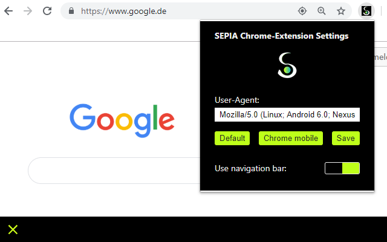

# sepia-browser-extensions
Browser extensions that add additional features when using SEPIA in browser kiosk-mode etc.

## Chromium
This extension adds a navigation bar (intended to be used in kiosk-mode where the close-tab button is missing) and makes the user-agent editable to e.g. load sites as mobile version (for small touch-screens).  
  
[SEPIA @ Chrome Web Store](https://chrome.google.com/webstore/detail/sepia-framework-tools/gbdjpbipoaacccffgemiflnhfldahopp)  
  

  

